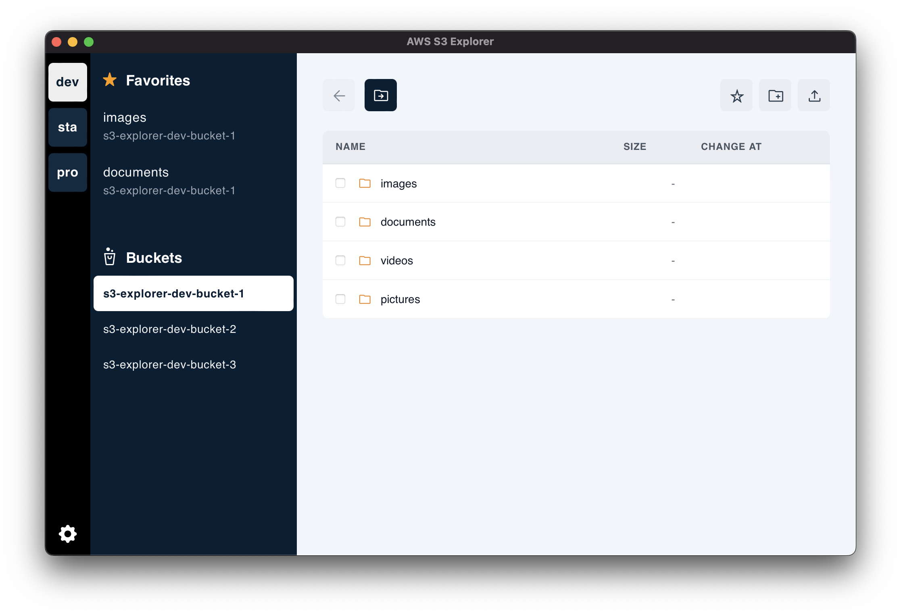

# s3-explorer

This is a tool for working with S3 on AWS.  
It allows you to upload local files and download files/folders from S3.  
The implementation of this application uses [TAURI](https://tauri.app).



## AWS Account

It is necessary to set a profile to use the aws command.  
It accesses AWS by reading the list of local device profiles from the config file and reading the authentication information from the credential file.

Therefore, it is necessary to execute the information such as the access key with the `aws configure` command.

## Run

```
$ yarn install
$ yarn tauri dev
yarn run v1.22.17
$ tauri dev
     Running BeforeDevCommand (`npm run dev`)
        Warn Waiting for your frontend dev server to start on http://localhost:3000/...

> s3-explorer@0.0.0 dev
> vite

  vite v2.9.13 dev server running at:

  > Local: http://localhost:3000/
  > Network: use `--host` to expose
```

## LISENCE

MIT License
